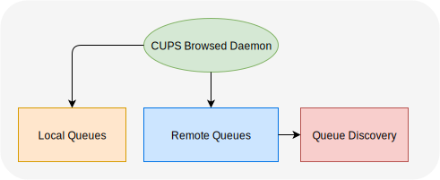
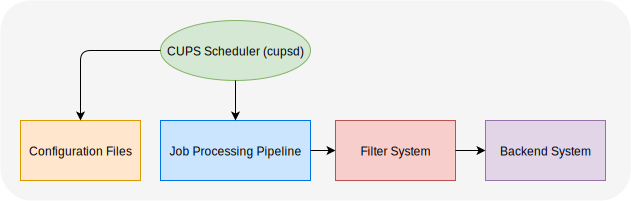

# CUPS (snap)

The standard printing environment for Linux operating systems

## Commands

| Command              | Explanation                                                                |
| -------------------- | -------------------------------------------------------------------------- |
| `cups.accept`        | Accepts jobs for a destination printer.                                    |
| `cups.cancel`        | Cancels a print job or all jobs on a destination.                          |
| `cups.cupsaccept`    | Accepts print jobs for a printer (similar to `cups.accept`).               |
| `cups.cupsctl`       | Configures and manages CUPS server settings.                               |
| `cups.cupsdisable`   | Disables a printer, stopping it from printing jobs.                        |
| `cups.cupsenable`    | Enables a printer, allowing it to print jobs.                              |
| `cups.cupsfilter`    | Converts files to a printable format using CUPS filters.                   |
| `cups.cupsreject`    | Rejects print jobs for a printer, preventing new jobs from being accepted. |
| `cups.cupstestppd`   | Tests PPD files for compatibility with CUPS.                               |
| `cups.driverless`    | Configures driverless printing for compatible printers.                    |
| `cups.gs`            | Runs Ghostscript for processing print jobs.                                |
| `cups.ippeveprinter` | Creates a temporary IPP Everywhere printer.                                |
| `cups.ippfind`       | Finds printers using the IPP protocol.                                     |
| `cups.ipptool`       | Sends IPP requests to test printer capabilities.                           |
| `cups.lp`            | Submits files for printing.                                                |
| `cups.lpadmin`       | Configures printer and class queues.                                       |
| `cups.lpc`           | Provides printer status information and administration commands.           |
| `cups.lpinfo`        | Lists available printers and drivers.                                      |
| `cups.lpoptions`     | Configures printer options.                                                |
| `cups.lpq`           | Displays the status of print jobs in a queue.                              |
| `cups.lpr`           | Submits files for printing (similar to `cups.lp`).                         |
| `cups.lprm`          | Removes print jobs from a queue.                                           |
| `cups.lpstat`        | Displays status information about the CUPS system.                         |
| `cups.reject`        | Rejects jobs for a destination printer (similar to `cups.cupsreject`).     |

## Services

### cups.cups-browsed



### cups.cupsd



## Logs

To read the logs from `cupsd` (snap), use the following command:

```bash
sudo snap logs cups.cupsd -n=all
sudo snap logs cups.cups-browsed -n=all
```

## Options

```bash
sudo snap run cups.lpinfo -lv

# Check current CUPS printer configuration
snap run cups.lpstat -lp

# Then use one of the printers for the next commands (Canon_MX925 here)

snap run cups.lpoptions -p Canon_MX925 -l

# Set default paper source to bottom tray
snap run cups.lpoptions -p Canon_MX925 -o InputSlot=Cassette
# or try:
snap run cups.lpoptions -p Canon_MX925 -o MediaSource=Auto
```

Example of output for `lpinfo -lv`

```text
Device: uri = dnssd://Canon%20MX925._ipp._tcp.local/?uuid=00000000-0000-1000-8000-9C32CE39A7D8
        class = network
        info = Canon MX925
        make-and-model = Canon MX920 series
        device-id = MFG:Canon;MDL:MX920 series;CMD:URF;
        location = 
Device: uri = ipp://Canon%20MX925._ipp._tcp.local/
        class = network
        info = Canon MX920 series (driverless)
        make-and-model = Canon MX920 series
        device-id = MFG:Canon;MDL:MX920 series;CMD:AppleRaster,URF,JPEG;
        location = 
```

`$ snap run cups.lpoptions -p Canon_MX925`:

- copies=1
- cups-browsed=true
- device-uri=implicitclass://Canon_MX925/
- finishings=3
- job-cancel-after=10800
- job-hold-until=no-hold
- job-priority=50
- job-sheets=none,none
- marker-change-time=0
- number-up=1
- print-color-mode=color
- printer-commands=none
- printer-info=Canon_MX925
- printer-is-accepting-jobs=true
- printer-is-shared=false
- printer-is-temporary=false
- printer-location
- printer-make-and-model='Canon Printer, driverless, 2.1.1'
- printer-state=3
- printer-state-change-time=1762625838
- printer-state-reasons=none
- printer-type=2134044
- printer-uri-supported=ipp://localhost/printers/Canon_MX925

`$ snap run cups.lpoptions -p Canon_MX925 -l`:

- PageSize / Media Size:
  - 200x148mm
  - 200x148mm.Borderless
  - 3.5x5
  - 3.5x5.Borderless
  - 4x6
  - 4x6.Borderless
  - 5x7
  - 5x7.Borderless
  - 8x10
  - 8x10.Borderless
  - **A4**
  - A4.Borderless
  - A5
  - A5.Borderless
  - B5
  - B5.Borderless
  - DoublePostcardRotated.Borderless
  - Env10
  - Env10.Borderless
  - EnvDL
  - EnvDL.Borderless
  - Legal
  - Legal.Borderless
  - Letter
  - Letter.Borderless
  - Postcard
  - Postcard.Borderless
  - Custom.WIDTHxHEIGHT
- InputSlot / Media Source:
  - **Auto**
  - Top
  - Bottom
- MediaType / Media Type:
  - Stationery
  - **Photographic**
  - CustomMediaTypePhotoPaperPlusGlossyIi
  - CustomMediaTypePhotoPaperProPlatinum
  - CustomMediaTypeMattePhotoPaper
  - CustomMediaTypeGlossyPhotoPaper
  - CustomMediaTypeHighResolutionPaper
  - CustomMediaTypeInkJetHagaki
  - CustomMediaTypeHagakiK
  - CustomMediaTypeHagaki
  - Envelope
  - CustomMediaTypeOtherPhotoPaper
  - CustomMediaTypePhotoPaperPlusSemiGloss
  - CustomMediaTypePhotoPaperProLuster
- ColorModel / Print Color Mode:
  - **RGB**
  - Gray
- Duplex / 2-Sided Printing:
  - **None**
  - DuplexNoTumble
  - DuplexTumble
- OutputBin / Output Tray:
  - **FaceUp**
- cupsPrintQuality / Print Quality:
  - **Normal**
  - High
